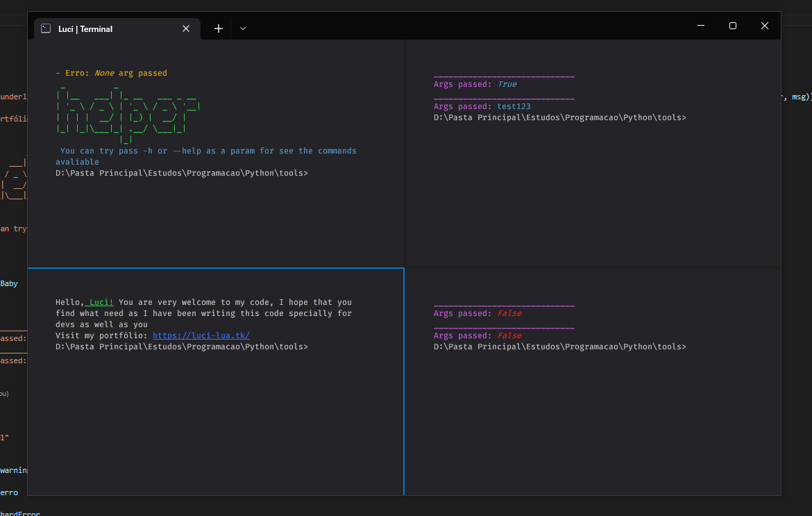

# 🐍 Python studies 
---

<p>
    Arguments, packages, code, functions, classes, conditional structures, very much code and among others
</p>

### 🌵 Install all packages with

```bash
cli.bat -i
```

<!-- > I used pip freeze for generate a list of packages and put the names (and versions) in requirement.txt or use pipreqs --force for put it correctly only what is necessary -->

### 🚗 Run

```bash
cli.bat [...args] 
```

### Args

> Show your name (or what you put after to -d param), necessarily requires a prefix
```bash 
-d --debug
``` 
> May or may not receive params, just show this, if true, print the param passed
```bash 
-t --test
``` 

> Show the commands avaliable 
```bash 
-h --help
``` 

## 🐑 Preview


